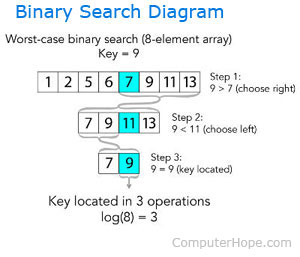

# Algorithms

## Week 3

### Topics

- C - `typeef struct`
- Recursion
- [Linear Search](#linear-search)
- [Binary Search](#binary-search)
- Sort Algorithms
    - Bubble Sort
    - Selection Sort
    - Insertion Sort
    - Merge Sort

---

### **Linear Search**

**Iterate across a data structure from left to right, searching for a specificied element.**

**In pseudocode**:

- Repeat, starting at the first element:
    - If the first element is what you're looking for (target), stop.
    - Otherwise, move to the next element.

#### Complexity

| Worse-case | Best-case |
|------------|-------------------|
| O(n): look at every single element | Ω(1): find the element immediately as the first element|

### **Binary Search**

**In binary search, the idea of the algorithm is to divide and conquer, reducing the search area by half each time, trying to find a target number.**

**The data structure must be sorted, because everything to the left must be lower than the right side.**

**In pseudocode**:

- Repeat until the there is no way to divide the data structure:
    - Calculate de middle point of the current sub(array).
    - If the target is at the middle, stop.
    - Otherwise, if the target is less than what's at the middle, repeat, changing the end point to be just to the left of the middle.
    - Otherwise, of the target is greater than what's at the middle, repeat, changing the start point to be just to the right of the middle.

#### Complexity

| Worse-case | Best-case |
|------------|-------------------|
| O(log n): Divide that array on `log of n` time when the element does not exist or is at the last division. | Ω(1): The element being searched is at the first half of the array.|